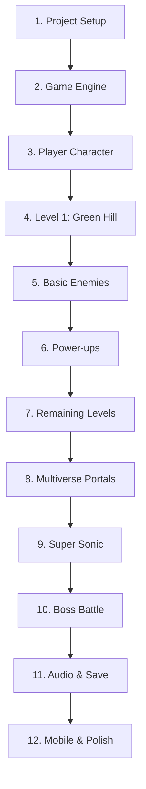

# Implementation Plan: Super Sonic in the Multiverse of Madness

> A 16-bit style H5 platformer with multiverse mechanics, Super Sonic transformation, and an epic boss battle.

---

## Technical Approach

### No Build Tools Required! 🎉
Since you don't have Node.js/npm installed, I'll build this game with **pure vanilla HTML5, CSS, and JavaScript**. This approach:
- Works immediately in any browser (just open `index.html`)
- No dependencies or build steps needed
- Easy to deploy anywhere
- Can be converted to a framework later if desired

---

## Project Structure

```
/Users/gurman/.gemini/antigravity/scratch/sonic-multiverse/
├── index.html              # Main entry point
├── css/
│   └── style.css           # Game styling & UI
├── js/
│   ├── main.js             # Game initialization
│   ├── engine/
│   │   ├── Game.js         # Main game loop
│   │   ├── Input.js        # Keyboard & touch input
│   │   ├── Physics.js      # Collision & physics
│   │   ├── Camera.js       # Viewport management
│   │   └── Audio.js        # Sound manager
│   ├── entities/
│   │   ├── Player.js       # Sonic character
│   │   ├── Enemy.js        # Base enemy class
│   │   ├── PowerUp.js      # Power-up items
│   │   └── Ring.js         # Collectible rings
│   ├── levels/
│   │   ├── LevelManager.js # Level loading/switching
│   │   ├── Level1.js       # Green Hill Prime
│   │   ├── Level2.js       # Neon City 2099
│   │   ├── Level3.js       # Lava Depths
│   │   ├── Level4.js       # Frozen Tundra
│   │   └── Level5.js       # Mushroom Kingdom Rift
│   ├── ui/
│   │   ├── HUD.js          # Score, rings, lives
│   │   ├── Menu.js         # Title & pause menus
│   │   └── TouchControls.js # Mobile controls
│   └── utils/
│       ├── SpriteSheet.js  # Sprite animation
│       └── Storage.js      # Save/load system
├── assets/
│   ├── sprites/            # Character & tile sprites
│   ├── backgrounds/        # Parallax backgrounds
│   └── audio/              # Music & SFX
└── README.md               # Project documentation
```

---

## Proposed Changes

### Core Engine Components

#### [NEW] [index.html](file:///Users/gurman/.gemini/antigravity/scratch/sonic-multiverse/index.html)
- HTML5 canvas element (320x224 native, scaled)
- Script loading with ES6 modules
- Responsive viewport meta tags
- Loading screen

#### [NEW] [style.css](file:///Users/gurman/.gemini/antigravity/scratch/sonic-multiverse/css/style.css)
- Retro pixel-perfect rendering (image-rendering: pixelated)
- Touch control overlay styling
- Menu and HUD styling
- Mobile responsive layout

#### [NEW] [Game.js](file:///Users/gurman/.gemini/antigravity/scratch/sonic-multiverse/js/engine/Game.js)
- 60 FPS game loop using requestAnimationFrame
- State machine: MENU → PLAYING → PAUSED → GAME_OVER
- Update/render cycle
- Delta time handling

#### [NEW] [Input.js](file:///Users/gurman/.gemini/antigravity/scratch/sonic-multiverse/js/engine/Input.js)
- Keyboard event listeners (keydown/keyup)
- Touch event handling with virtual controls
- Input state polling system
- Configurable key bindings

#### [NEW] [Physics.js](file:///Users/gurman/.gemini/antigravity/scratch/sonic-multiverse/js/engine/Physics.js)
- Gravity simulation (Sonic-style floaty jumps)
- AABB collision detection
- Tile-based collision for platforms
- Slope handling (classic Sonic mechanic)

---

### Player Character

#### [NEW] [Player.js](file:///Users/gurman/.gemini/antigravity/scratch/sonic-multiverse/js/entities/Player.js)

**Movement Physics:**
| Property | Value |
|----------|-------|
| Max Speed | 12 px/frame |
| Acceleration | 0.5 px/frame² |
| Deceleration | 0.3 px/frame² |
| Jump Force | -16 px/frame |
| Gravity | 0.8 px/frame² |

**States:**
- Idle, Running, Jumping, Falling
- Spin Dash (charge & release)
- Rolling (ball form)
- Hurt, Death
- Super Sonic (powered up)

**Features:**
- Ring collection (protects from damage)
- Ring scatter on hit
- Lives system (3 starting lives)
- Invincibility frames after damage

---

### Level System

#### [NEW] [LevelManager.js](file:///Users/gurman/.gemini/antigravity/scratch/sonic-multiverse/js/levels/LevelManager.js)
- JSON-based level data format
- Tile map rendering (16x16 tiles)
- Entity spawning from level data
- Portal/transition system
- Checkpoint management

**Level Data Format:**
```javascript
{
  name: "Green Hill Prime",
  width: 200,  // tiles
  height: 15,  // tiles
  tileSize: 16,
  tileset: "greenhill",
  layers: {
    background: [...],  // 2D array of tile IDs
    collision: [...],   // Collision map
    foreground: [...]   // Decorative overlay
  },
  entities: [
    { type: "ring", x: 100, y: 50 },
    { type: "enemy", x: 300, y: 100, variant: "motobug" },
    { type: "portal", x: 500, y: 80, destination: "level2" }
  ],
  parallax: [
    { image: "sky.png", speed: 0.1 },
    { image: "mountains.png", speed: 0.3 },
    { image: "trees.png", speed: 0.6 }
  ]
}
```

---

### Power-Up System

#### [NEW] [PowerUp.js](file:///Users/gurman/.gemini/antigravity/scratch/sonic-multiverse/js/entities/PowerUp.js)

| Power-Up | Sprite | Effect | Implementation |
|----------|--------|--------|----------------|
| Shield | Blue bubble | Absorb 1 hit | `player.hasShield = true` |
| Speed | Yellow lightning | 2x speed | `player.speedMultiplier = 2` |
| Invincibility | Stars | No damage | `player.invincible = true` |
| Multiverse Dash | Purple swirl | Phase through | `player.canPhase = true` |
| Chaos Emerald | Colored gems | Collect for Super | `game.emeralds++` |

**Super Sonic Transformation:**
```javascript
if (player.emeralds >= 7 && player.rings >= 50) {
  player.transform('super');
  // Golden palette, flight, invincibility
  // Drains 1 ring/second
}
```

---

### Boss Battle System

#### [NEW] [Boss.js](file:///Users/gurman/.gemini/antigravity/scratch/sonic-multiverse/js/entities/Boss.js)

**The Plumber - 3 Phase Fight:**

| Phase | HP | Attacks | Arena |
|-------|-----|---------|-------|
| 1 | 3 hits | Fireball barrage, ground pound | Flat platform |
| 2 | 3 hits | Platform jumping, shell throw | Multi-platform |
| 3 | 2 hits | Power Star form, beam attacks | Final showdown |

**Victory Sequence:**
- Boss defeat animation
- Score tally
- Credits roll
- Return to title with "Game Complete" save

---

### Audio System

#### [NEW] [Audio.js](file:///Users/gurman/.gemini/antigravity/scratch/sonic-multiverse/js/engine/Audio.js)
- Web Audio API for low-latency SFX
- HTML5 Audio for background music
- Volume controls (master, music, sfx)
- Mute toggle

**Royalty-Free Sources:**
- Music: OpenGameArt.org, FreeMusicArchive
- SFX: Freesound.org, JSFXR-generated

---

### Save System

#### [NEW] [Storage.js](file:///Users/gurman/.gemini/antigravity/scratch/sonic-multiverse/js/utils/Storage.js)

**Save Data Structure:**
```javascript
{
  version: 1,
  progress: {
    currentLevel: 3,
    unlockedLevels: [1, 2, 3],
    emeralds: [true, true, false, false, false, false, false],
    bestTimes: { level1: 45000, level2: 62000 }
  },
  highScores: [
    { name: "ACE", score: 150000 },
    { name: "SON", score: 120000 }
  ],
  settings: {
    musicVolume: 0.8,
    sfxVolume: 1.0,
    controls: "keyboard"
  }
}
```

---

## Asset Generation Plan

### Sprites (AI-Generated Pixel Art)
I'll generate these using the image generation tool:

1. **Sonic** - Running, jumping, spin dash, hurt, super form
2. **Enemies** - 3-4 types per level theme
3. **Power-ups** - Shield, speed, invincibility, emeralds
4. **Boss** - Plumber character with attack animations
5. **Tiles** - Platforms, decorations for each universe
6. **UI** - HUD elements, menu buttons, title logo

### Backgrounds (Per Level)
- Parallax layers for depth effect
- Themed to each universe aesthetic

---

## Verification Plan

### Automated Testing
```bash
# Open in browser and verify:
open /Users/gurman/.gemini/antigravity/scratch/sonic-multiverse/index.html
```

### Manual Testing Checklist
- [ ] Sonic moves smoothly with keyboard
- [ ] Touch controls work on mobile
- [ ] All 5 levels load and play
- [ ] Power-ups function correctly
- [ ] Super Sonic transformation works
- [ ] Boss battle is beatable
- [ ] Progress saves and loads
- [ ] Audio plays without issues
- [ ] No visual glitches

### Browser Compatibility
- Chrome (primary)
- Firefox
- Safari
- Mobile Chrome/Safari

---

## Implementation Order



---

## Estimated Timeline

| Phase | Components | Approx. Effort |
|-------|-----------|----------------|
| Engine | Game loop, input, physics | ⏱️ Core foundation |
| Player | Movement, animations, states | ⏱️ Key gameplay |
| Levels | 5 themed worlds | ⏱️ Content creation |
| Features | Power-ups, Super Sonic, boss | ⏱️ Special mechanics |
| Polish | Audio, saves, mobile | ⏱️ Final touches |

---

> [!IMPORTANT]
> **Ready to begin?** Once you approve this plan, I'll start building the game phase by phase, generating assets as needed!
